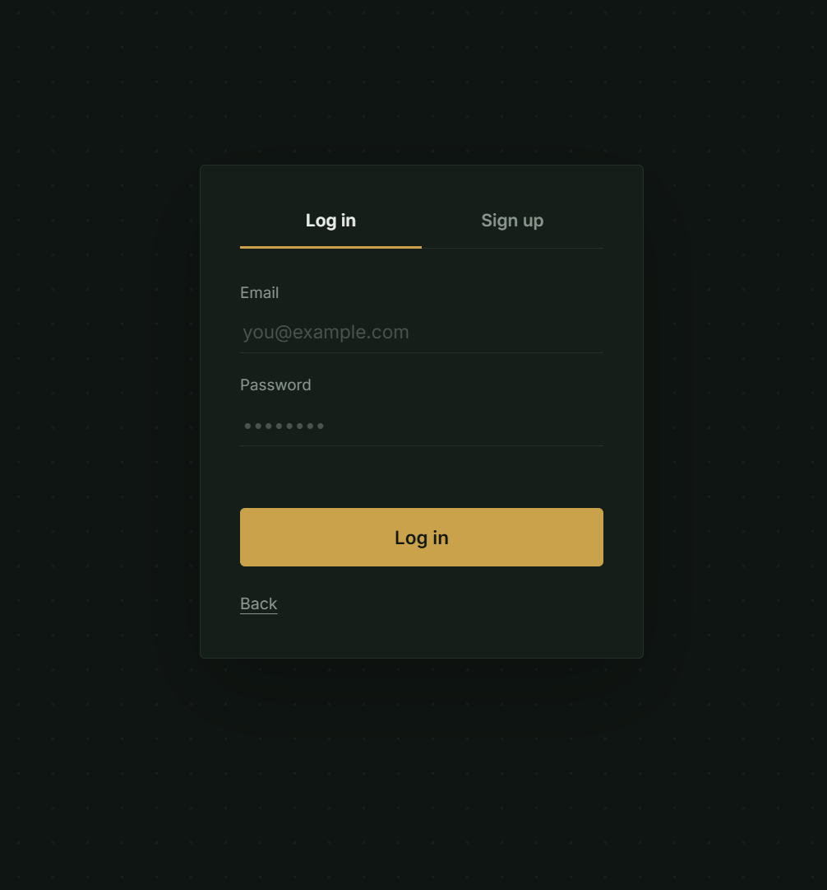
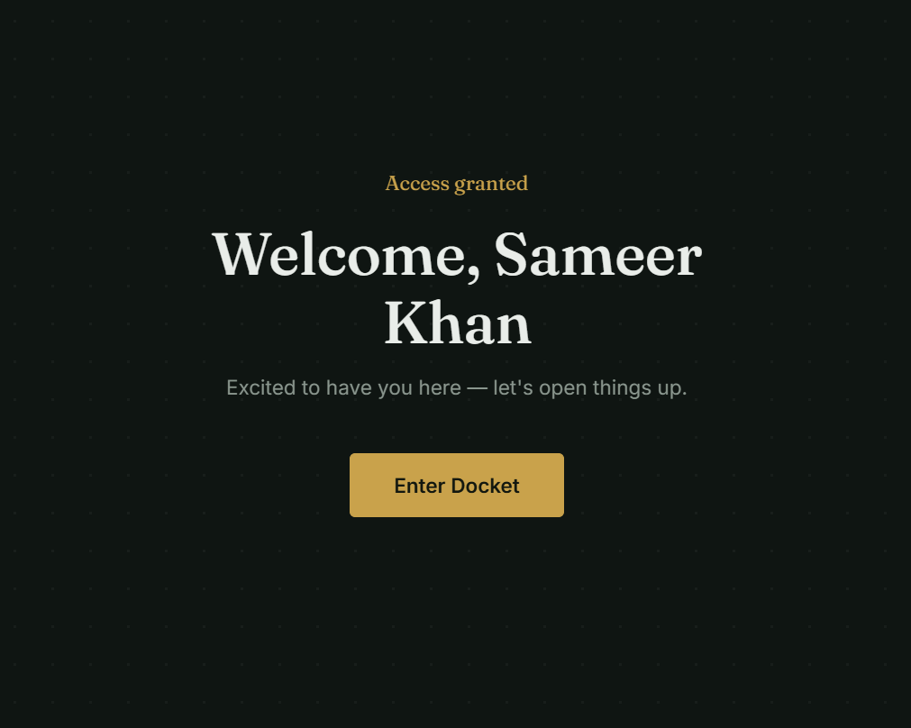
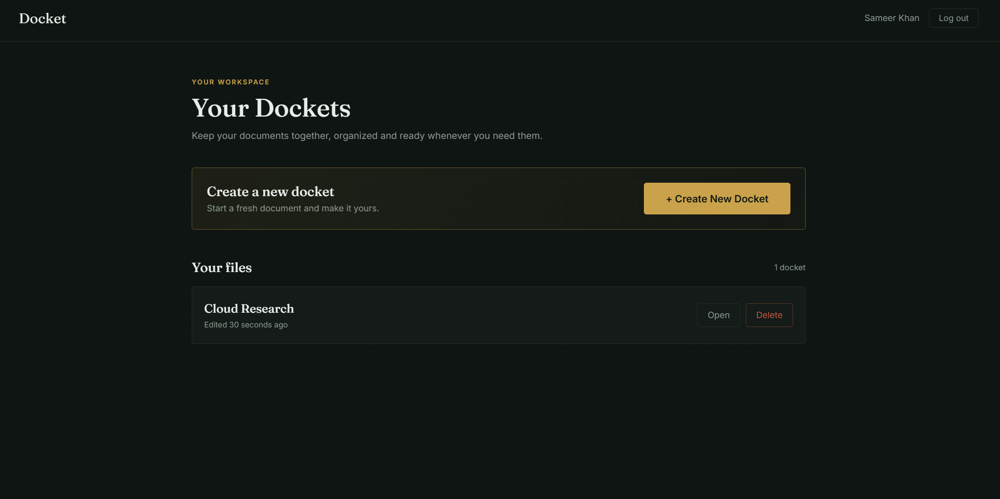
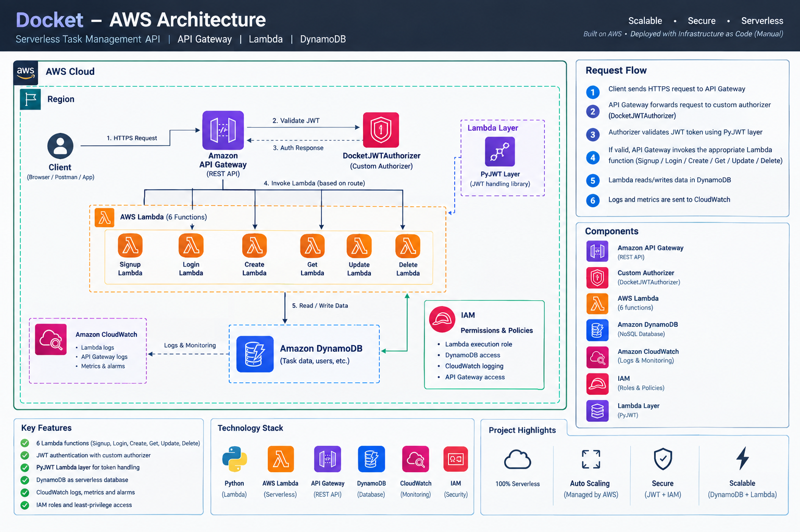

# Docket

**A serverless document management app built on AWS.**
Users sign up, log in, and manage their own documents through a JWT-secured REST API. There are no servers to provision or patch, and it scales on demand.


**Live demo: https://d1xq24fvl0yoc5.cloudfront.net**

---

## Screenshots

| Login / Signup | Welcome Screen | Documents |
|---|---|---|
|  |  |  |

More screenshots of AWS Services are available in the [screenshots](Screenshots/) folder

---

## Overview

Docket is the serverless project in my AWS portfolio. It is a counterpart to my server-based Task Manager project, built to show how the same kind of problem (authenticated users managing their own data) can be solved with a fully managed, event-driven architecture.

**What it does**

- User registration and login
- Stateless authentication with JSON Web Tokens (JWT)
- Full CRUD for documents (create, read, update, delete)
- Every protected route is verified by a dedicated Lambda authorizer
- Per-user data, split across two DynamoDB tables

---

## Architecture



**Request flow**

1. The user signs up or logs in. Signup and login are public routes.
2. On a successful login, the API returns a signed JWT.
3. The frontend sends the token with every document request.
4. API Gateway calls `jwtauthorizer` first. Invalid or missing tokens are rejected before any business logic runs.
5. If the token is valid, the matching Lambda reads or writes the `docs` table.

---

## AWS Services

| Service | Role |
|---|---|
| **API Gateway** | REST API with 6 methods, single entry point for the frontend |
| **Lambda** | 7 functions containing all backend logic |
| **DynamoDB** | Two tables: `users` and `docs` |
| **IAM** | Least-privilege execution roles for each function |
| **CloudWatch** | Logs and debugging for Lambda and API Gateway |

---

## Lambda Functions

| Function | Purpose | Auth required |
|---|---|:---:|
| `signup` | Creates a new user in the `users` table | No |
| `login` | Verifies credentials and issues a JWT | No |
| `createfile` | Creates a new document | Yes |
| `getfile` | Retrieves the user's document(s) | Yes |
| `updatefile` | Updates an existing document | Yes |
| `deletefile` | Deletes a document | Yes |
| `jwtauthorizer` | Validates the JWT and authorizes each protected request | n/a |

---

## API Endpoints

| Method | Route | Lambda | Auth |
|---|---|---|:---:|
| `POST` | `/signup` | `signup` | No |
| `POST` | `/login` | `login` | No |
| `POST` | `/files` | `createfile` | Yes |
| `GET` | `/files` | `getfile` | Yes |
| `PUT` | `/files/{id}` | `updatefile` | Yes |
| `DELETE` | `/files/{id}` | `deletefile` | Yes |

Protected routes expect the header:

```
Authorization: Bearer <jwt-token>
```

**Example: login**

```http
POST /login
Content-Type: application/json

{
  "email": "user@example.com",
  "password": "your-password"
}
```

```json
{
  "token": "<jwt-token>"
}
```

---

## Data Model

**`users` table**

| Attribute | Type | Notes |
|---|---|---|
| `Email` | String | Partition key, unique identifier of the user |
| `name` | String | User's display name (shown on the welcome screen) |
| `passwordHash` | String | Hashed password, plain-text passwords are never stored |

**`docs` table**

| Attribute | Type | Notes |
|---|---|---|
| `Email` | String | Partition key, owner of the document |
| `id` | String | Sort key, unique document ID |
| `content` | String | Document body |
| `createdAt` | String | Creation timestamp |
| `updatedAt` | String | Last modified timestamp |
| `UserName` | String | Owner's name, stored with the document |

---

## Frontend

The frontend is gated behind authentication:

1. The service is locked behind a single entry button.
2. Clicking it opens a signup / login form.
3. After a successful login, a welcome screen greets the user by name.
4. The document service then unlocks.

**Stack:** HTML, CSS, JavaScript

---

## Getting Started

### Prerequisites

- An AWS account
- AWS CLI configured (`aws configure`)
- TODO: name the runtime your Lambdas use (Python or Node.js)

### Deployment

1. **Create the DynamoDB tables:** `users` and `docs`.
2. **Create the 7 Lambda functions** and attach an IAM role with access to the required tables and CloudWatch Logs.
3. **Set environment variables** on the Lambdas (see below).
4. **Create the API Gateway** REST API, add the 6 methods, and integrate each with its Lambda.
5. **Attach `jwtauthorizer`** as a Lambda authorizer on the protected methods.
6. **Deploy the API** to a stage and copy the invoke URL.
7. **Set the API URL** in the frontend config and open the app.

### Environment Variables

| Variable | Used by | Description |
|---|---|---|
| `JWT_SECRET` | `login`, `jwtauthorizer` | Secret used to sign and verify tokens |
| `USERS_TABLE` | `signup`, `login` | Name of the users table |
| `DOCS_TABLE` | file functions | Name of the docs table |

> Never commit secrets to the repository.

---

## Security

- Stateless JWT authentication, verified centrally by a Lambda authorizer
- Protected routes are rejected at the API Gateway layer before reaching business logic
- Passwords are stored as hashes, never in plain text
- IAM roles scoped per function

---

## Related Projects

More projects from my AWS portfolio:

1. **Task Manager:** Django app on VPC + EC2 + Auto Scaling + ALB + RDS (traditional server-based architecture)
2. **Docket** (this project): fully serverless architecture
3. **Static Site:** S3 + CloudFront (SSL) + Route 53 custom domain
4. **Thumbly:** serverless image processing pipeline with S3 events, Lambda and Pillow

---

## Author

**Muhammad Sameer Khan**
BS Cloud Computing & Information Science, SSUET, Karachi

GitHub: https://github.com/sameerkhanio | LinkedIn: https://www.linkedin.com/in/sameerkhanio/
